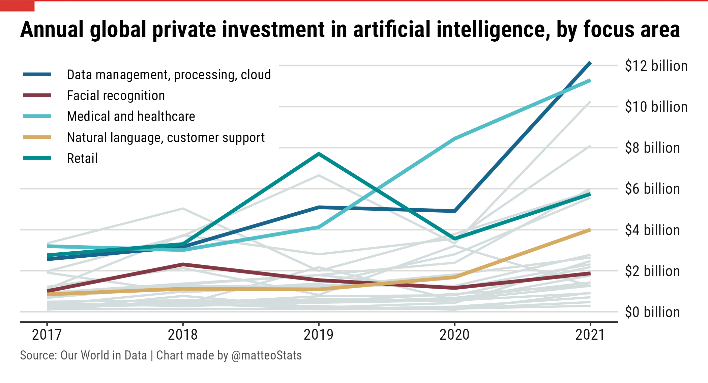
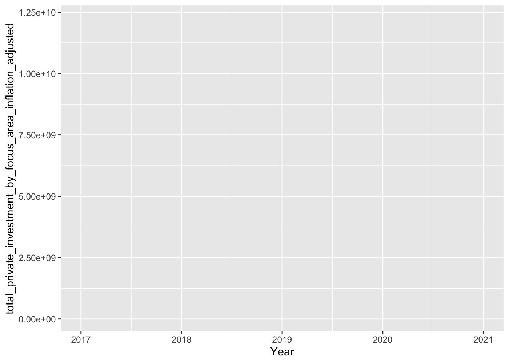
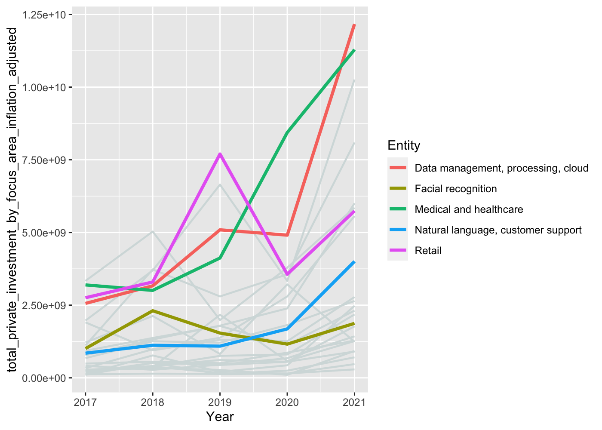
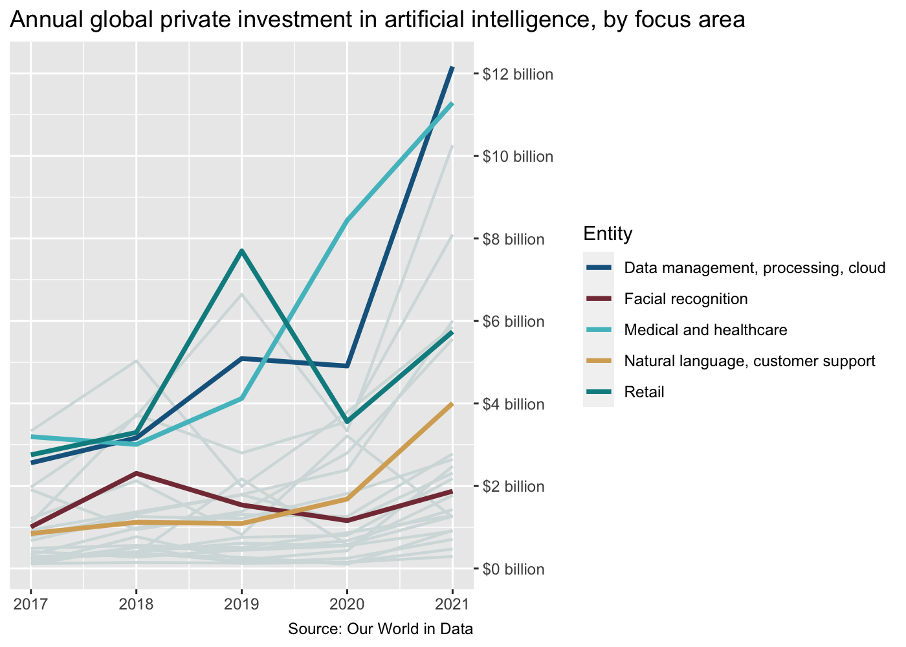

Creating a Chart in the Style of The Economist
================

In this article, and in the context of my application for a summer
internship as a data journalist at The Economist, I will show you a
step-by-step tutorial on how to create a chart that could have been
published by the renowned newspaper with R’s `ggplot2`:

<figure>

<figcaption aria-hidden="true">The Economist Style Plot</figcaption>
</figure>

I drew inspiration from this insightful [Medium
article](https://medium.economist.com/charting-new-territory-7f5afb293270)
by Helen Atkinson, visual data journalist at The Economist, in which she
explains the thought process and factors that go into her decisions when
producing charts. She also mentions that forming a set of guidelines to
help optimise content in The Economist’s feed is especially important on
platforms such as Instagram where people can easily scroll past content
that doesn’t immediately grab their attention.

I am passionate about the evolution of new technologies and AI, so I
decided plot the evolution of annual global private investment in
artificial intelligence, by focus area, between 2017 and 2021. The
source data was provided by [Our Word in
Data](https://ourworldindata.org) and can be downloaded
[here](https://ourworldindata.org/grapher/private-investment-in-artificial-intelligence-by-focus-area?country=Drones~Educational+tech~Energy%2C+oil%2C+and+gas~Facial+recognition~Natural+language%2C+customer+support~Medical+and+healthcare~Retail~Data+management%2C+processing%2C+cloud).

Let’s get started!

## Data Pre-Processing

#### Libraries and Setup

``` r
library(tidyverse)
library(ggthemes)
library(ggplot2)
library(scales)
library(magick)

data <- read_csv("data/private-investment-in-artificial-intelligence-by-focus-area.csv")
```

#### Data Pre-Processing

The dataset contains the inflation adjusted total private investment in
artificial intelligence across 26 different focus areas. Not much
wrangling is necessary here because the data provided by Our World in
Data provides is already tidy and clean. We just need to remove the
total investment because it will make the lines of individual focus
areas impossible to distinguish due to the difference in scale.

``` r
names(data)
```

    ## [1] "Entity"                                                   
    ## [2] "Code"                                                     
    ## [3] "Year"                                                     
    ## [4] "total_private_investment_by_focus_area_inflation_adjusted"

``` r
data <- data %>%
  filter(Entity != "Total")
```

## Data Visualisation

I love highlighted slope charts because they allow to put the evolution
of a metric in perspective with the evolution of the others. A simple
trick to generate these highlighted slope charts is to stack line
layers. First, create an all-grey slope chart for all areas Then, do the
same but with a smaller data set (containing the selected focus areas).
In this layer, you can change the color and the thickness of the lines.

And for the more curious among you, this is The Economist’s [visual
styleguide](https://design-system.economist.com/documents/CHARTstyleguide_20170505.pdf).
I used it for the selection of line colors and width, but it is also a
gold mine in terms of advice for anyone interested in data
visualization. If you are in need of inspiration, plenty of examples of
charts and maps made by the data team of The Economist can be found
[here](https://www.economist.com/graphic-detail).

``` r
#selection of the colors for highlighted lines
highlight_colors <- c("#17648d", "#51bec7", "#008c8f", "#d6ab63", "#843844")
#selection of 5 focus areas
names(highlight_colors) <- c('Data management, processing, cloud', 
                             'Medical and healthcare', 
                             'Retail',
                             'Natural language, customer support',
                             'Facial recognition')

#new data frame with only those 5 focus areas
highlight_data <- data %>%
  filter(Entity %in% names(highlight_colors))

#usual background colours for The Economist charts
bg_col_beige <- "#f1f0e9"
bg_col_blue <- "#dee9ec"
```

Now that we set up the focus areas and their colors, we can begin by
creating our ggplot “canvas”:

``` r
ggplot(data, aes(Year, total_private_investment_by_focus_area_inflation_adjusted, group = Entity))
```

<!-- -->

Notice how I grouped by Entity; this allows to plot one line for each
focus area. Now we can add the geometrical elements, setting up the
highlighted slopes chart.

``` r
ggplot(data, aes(Year, total_private_investment_by_focus_area_inflation_adjusted, group = Entity))+
  geom_line(linewidth = 0.75, color = '#d4dddd') +
  geom_line(data = highlight_data, aes(color = Entity), linewidth = 1.25) 
```

<!-- -->

The chart is starting to convey some information! Now let’s adjust the x
and y axis properties and the colors. Notice the use of the `scales`
package for the y-axis, and the colors set up earlier.

We can also add the title and caption.

``` r
ggplot(data, aes(Year, total_private_investment_by_focus_area_inflation_adjusted, group = Entity))+
  geom_line(linewidth = 0.75,color = '#d4dddd') +
  geom_line(data = highlight_data, aes(color = Entity), linewidth = 1.25) +

  labs(title = "Annual global private investment in artificial intelligence, by focus area",
       caption = "Source: Our World in Data",
       x = NULL,
       y = NULL)+
  scale_y_continuous(position = "right",
                     labels = scales::dollar_format(prefix = "$", suffix = " billion", scale = 1e-9),
                     breaks = seq(0, 12e9, by = 2e9))+
  scale_colour_manual(values = highlight_colors)
```

<!-- -->

Finally, we can adjust the appearance of the plot by adjusting
`theme()`. There is a lot of elements in there, so I would advise you
play around with them to understand their role and mechanics.

I’m using “Roboto Condensed” from \[Google
Fonts\]((<https://fonts.google.com/specimen/Roboto+Condensed?query=roboto+condensed>)
for the following plot. If you don’t know how to import your system
fonts, you can use the `extrafont` package. You can follow [this
tutorial](https://r-coder.com/custom-fonts-r/) for some help!

``` r
plot <- ggplot(data, aes(Year, total_private_investment_by_focus_area_inflation_adjusted, group = Entity)) + 
  geom_line(linewidth = 0.75,color = '#d4dddd') +
  geom_line(data = highlight_data, aes(color = Entity), linewidth = 1.25) +

  labs(title = "Annual global private investment in artificial intelligence, by focus area",
       caption = "Source: Our World in Data | Chart made by @matteoStats",
       x = NULL,
       y = NULL)+
  scale_y_continuous(position = "right",
                     labels = scales::dollar_format(prefix = "$", suffix = " billion", scale = 1e-9),
                     breaks = seq(0, 12e9, by = 2e9))+
  scale_colour_manual(values = highlight_colors) +
  theme(aspect.ratio = 3.2/7,
        text = element_text(family = "Roboto Condensed"),
        plot.margin = margin(t = 0, r = 0.5, b = 0, l = 0.5, unit = "cm"),
        plot.background = element_rect(fill = "white"),
        panel.background = element_rect(fill = "white"),
        panel.grid.major.x = element_blank(),
        panel.grid.minor.x = element_blank(),
        panel.grid.major.y = element_line(color = "#dcdbd8"),
        panel.grid.minor.y = element_blank(),
        legend.text = element_text(margin = margin(l=3), size = 10),
        legend.title = element_blank(),
        legend.position = c(0.21, 0.77),
        legend.key.width = unit(25,"pt"),
        legend.key.height = unit(15, "pt"),
        legend.key = element_blank(),
        axis.text = element_text(size = rel(1), color = "gray8"),
        axis.line.x  = element_line(color = "gray8"),
        axis.ticks.y = element_blank(),
        plot.title = element_text(size = rel(1.5), hjust = 0, face = "bold"),
        plot.caption = element_text(hjust = 0, size = 9, colour = "#4B4B4B"))

plot
```

<!-- -->

Now (hopefully) you can recognize the style of The Economist! We can
save the plot and, as a bonus, we can even use the `magick` package to
add the classic red header.

``` r
ggsave(plot = plot, filename = "plot.png", width = 7, height = 3.8)

p <- image_read("plot.png")
head <- image_read("header2.png")

economist_plot <- image_flatten(c(p,head))

image_write(economist_plot, "TheEconomist_plot.png")
```

And here is the result:

<figure>

<figcaption aria-hidden="true">The Economist Style Plot</figcaption>
</figure>
